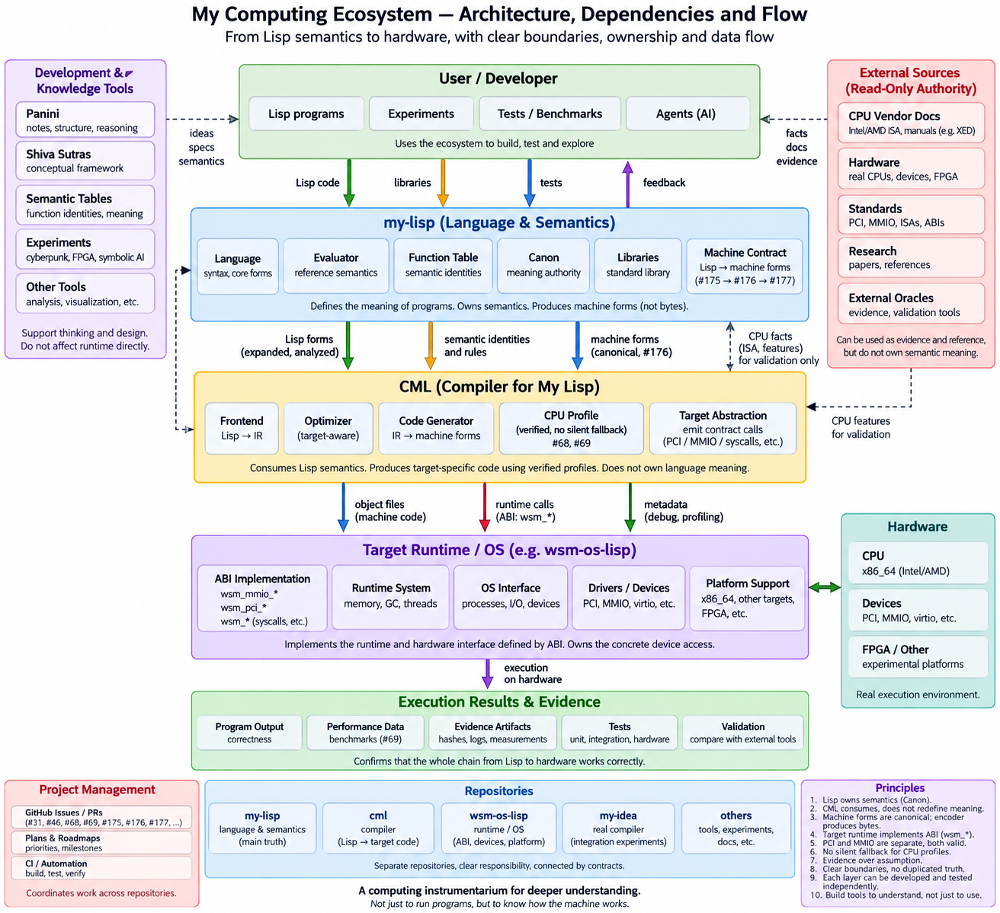

# Архітектура обчислювальної екосистеми — потоки й залежності (2026-09-15)

Схема архітектури повного стеку, авторства власника: від семантики Lisp до
заліза. `wsm-my-lisp` — це доказовий споживач фізичного самохостингу: він
демонструє, що Lisp-owned семантика та машинні контракти `my-lisp` (Canon,
таблиця функцій, Machine Contract) фізично досягають target/self-hosting
виконання на власному x86-64 залізі власника, поступово нарощуючи
незалежність від Rust-бутстрапу my-lisp по одній можливості за раз. Lisp —
це логіка/поведінка/machine-facing представлення; ASM — незвідний
target/bootstrap/ABI механізм — жодного C/Rust evaluator чи runtime в
канонічній production-цілі, якщо це окремо не перератифіковано.

Повний стек, згори донизу: Користувач/розробник → **my-lisp** (Мова та
семантика, володіє Canon/значенням) → **CML** (компілятор для My Lisp) →
Target Runtime/OS (цей репо демонструє target/self-hosting доказову
сторону цього шару) → Залізо.

Ця схема — знімок наміру, а не сама по собі авторитетний документ:
`juv4uk/ecosystem#7` (жива крос-репо карта) лишається авторитетним,
оновлюваним на місці джерелом істини про поточне володіння та межі.
